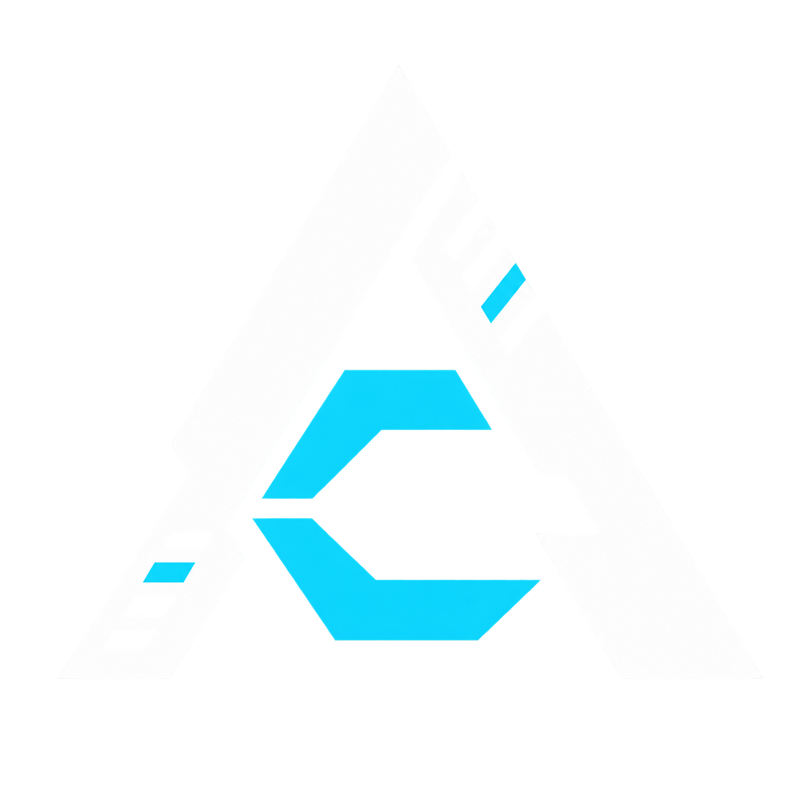
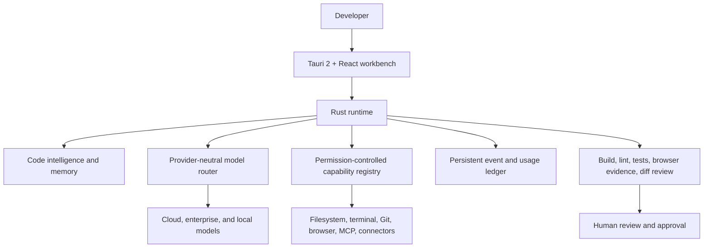
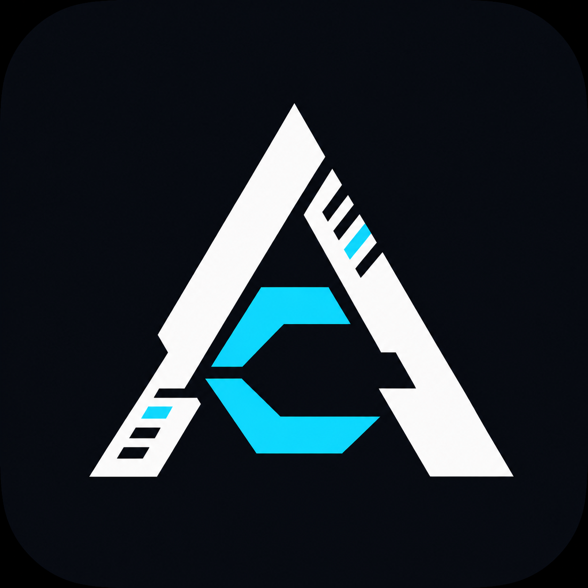

<p align="center">
  
</p>

<h1 align="center">Any Code</h1>

<p align="center"><strong>Any model. Any codebase. Any tool. One workspace.</strong></p>
<p align="center">A local-first, provider-independent agentic software engineering environment.</p>
<p align="center"><strong>Powered by <a href="https://heptagram-ai.com">heptagram-ai.com</a>.</strong></p>

<p align="center">
  <a href="https://github.com/sabih-haider1/Any-Code/actions/workflows/ci.yml"></a>
  <a href="https://github.com/sabih-haider1/Any-Code/actions/workflows/desktop-release.yml"></a>
</p>

## What Any Code will do

Any Code is being built as a universal execution environment for AI software engineering—not a
multi-model chat wrapper. The finished workflow will let a developer open a repository, describe
an outcome, review an agent's plan and permissions, watch isolated work execute, inspect the diff
and cost, and accept only results backed by tests and observed evidence.

The product is designed around:

- Replaceable OpenAI, Anthropic, Google, OpenRouter, local, and compatible model providers
- A persistent agent runtime with planning, tools, cancellation, recovery, and verification
- Targeted code intelligence instead of sending whole repositories to a model
- Runtime-enforced permissions, secret isolation, auditable events, and human approval
- Git worktree isolation for parallel agents
- Browser-based behavioral verification and visible evidence
- One capability registry for native tools, MCP, connectors, skills, and sandboxed plugins
- Local execution by default, with optional VPS/cloud continuation in later releases

The authoritative product definition is [PRD.md](PRD.md). Delivery boundaries live in
[docs/PRODUCT-SCOPE.md](docs/PRODUCT-SCOPE.md), and binding rules live in
[docs/PROJECT-RULES.md](docs/PROJECT-RULES.md).

## How it works



The security rule is simple: **the model may request; the runtime decides.** Repository text,
terminal output, browser content, MCP responses, and model output are untrusted data—not authority.

## Current visual identity

<table>
  <tr>
    <td align="center" width="50%">
      
      <br /><strong>Canonical mark</strong>
    </td>
    <td align="center" width="50%">
      
      <br /><strong>Application icon</strong>
    </td>
  </tr>
</table>

The running Phase 0 desktop shell now uses this identity in its header, favicon, macOS/Windows
bundle icons, loading and error states, and package metadata. A real application screenshot will be
added after an authorized capture run; the latest local attempt was blocked by macOS screen-recording
permission and is recorded in [REVIEW.md](REVIEW.md). No generated mock screenshot is presented as
working product UI.

Brand usage and the `AC:32A2A` / `110010101000101010` signature are documented in
[docs/BRAND.md](docs/BRAND.md).

## Project status

**Phase 0 — Foundation.** The repository currently contains:

- A Rust core with typed trust boundaries and append-only event foundations
- A SQLite-backed local settings store
- A working Tauri 2 + React + TypeScript desktop shell
- Shared dark, light, system, and high-contrast design tokens
- Real macOS and Windows icon assets and bundle configuration
- Cross-platform Rust CI plus a draft native desktop release workflow
- Graphify repository intelligence for Codex, Claude Code, and generic agents
- Persistent QA history in [REVIEW.md](REVIEW.md)

See [docs/ROADMAP.md](docs/ROADMAP.md) for phase exit conditions. A roadmap item is not treated as
implemented merely because it appears in the PRD.

## Repository layout

```text
apps/desktop/             Tauri 2 + React desktop client
assets/brand/             Canonical logo and app-icon sources
crates/anycode-core/      Trust and event primitives
crates/anycode-store/     Local SQLite persistence
packages/design-tokens/   Shared visual tokens and theme runtime
docs/                     Architecture, scope, security, operations, and ADRs
graphify-out/             Shared repository knowledge graph
```

## Develop locally

Requirements: Node.js 20+, pnpm 9+, the stable Rust toolchain, and the native Tauri prerequisites
for your operating system.

```bash
git clone https://github.com/sabih-haider1/Any-Code.git
cd Any-Code
pnpm install
pnpm dev
```

Run the native desktop shell:

```bash
pnpm --filter @anycode/desktop tauri dev
```

Run the verification suite:

```bash
pnpm lint
pnpm build
cargo fmt --all --check
cargo clippy --workspace --all-targets --all-features -- -D warnings
cargo test --workspace
```

Every test or QA run must be appended to [REVIEW.md](REVIEW.md), including failures and skipped
checks.

## Releases

GitHub Actions builds draft Windows and macOS packages when an `app-v*` tag is pushed or the
Desktop Release workflow is started manually. Builds are currently unsigned until protected Apple
and Windows signing credentials are configured. See [docs/RELEASING.md](docs/RELEASING.md).

Planned canonical artifacts are:

- macOS: signed and notarized `.dmg`
- Windows: signed NSIS `.exe` and `.msi`
- Linux: `.AppImage` and `.deb` when Linux enters scope
- Android: `.apk` and `.aab` in Phase 10
- iOS: signed archive/`.ipa` through Apple's distribution workflow in Phase 10

## Security and operations

- Secrets stay in operating-system credential storage and never enter prompts or logs.
- `.env.vps` is ignored deployment configuration and must never be committed or quoted.
- Local Only mode cannot depend on the VPS.
- Existing staging services and online checks follow [docs/OPERATIONS.md](docs/OPERATIONS.md).
- Security boundaries and reporting are documented in [docs/SECURITY.md](docs/SECURITY.md).

## Agent context

Graphify maintains a local knowledge graph so coding agents can query architecture and
relationships before broadly reading the repository. Setup and refresh rules are in
[docs/KNOWLEDGE-GRAPH.md](docs/KNOWLEDGE-GRAPH.md).

---

<p align="center"><code>AC:32A2A</code> · <code>110010101000101010</code></p>
<p align="center">Powered by <a href="https://heptagram-ai.com">heptagram-ai.com</a></p>
